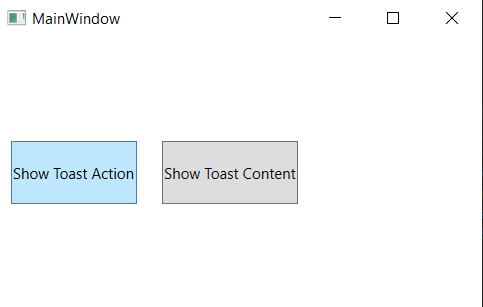
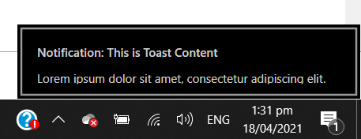
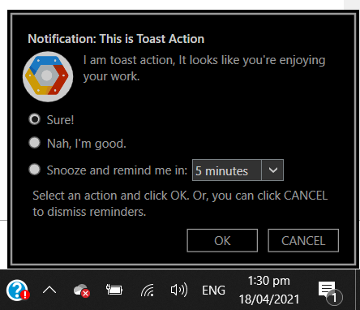

# WPF-Toast

Show Toast Notifications in WPF Applications

## How to Show Toast Notifications in Your Next WPF Apps

Windows Toast Notifications (or simply Toasts) are flat notifications that pop up in the bottom right corner of your screen and can be accessed through the Windows Action Center. You can incorporate these notifications in your next Windows Presentation Foundation app by using this WPF-Toast control.

To see toasts in action, launch the "[DemoApp](WPF-Toast\WPF.Toast\DemoApp)" and click on any of the displayed buttons.

**WPF Toast Notification offers two notification control.**

| Toast Control  | Descriptions                                                                                                                              |
| -------------- | ----------------------------------------------------------------------------------------------------------------------------------------- |
| `ToastContent` | Allows you to display simple text notifications to users. The notification fades off after `0:0:1.5` time interval.                       |
| `ToastAction`  | Allows you to display text and visual elements on the screen. It provides reminder functionality for the user to snooze the notification. |

_Toast Content_

_Toast Action_

## Contributions

The WPF Toast still requires little touches and exposing of some members for client's customisation. Please, feel free to contribute to the project.

See: [How to Contribute on GitHub](https://www.dataschool.io/how-to-contribute-on-github/)
